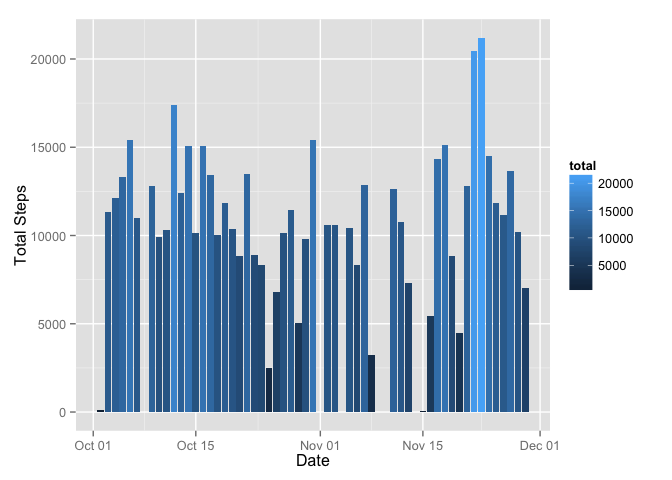
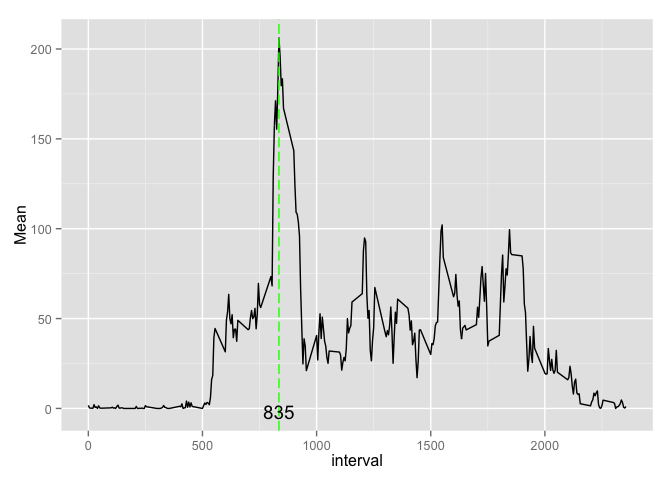
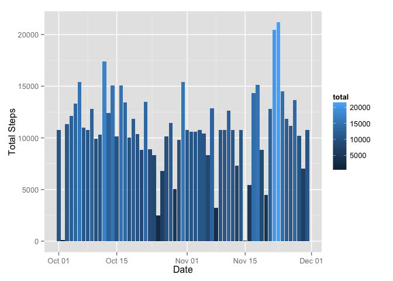
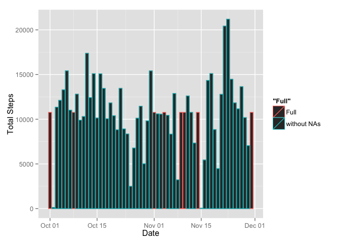
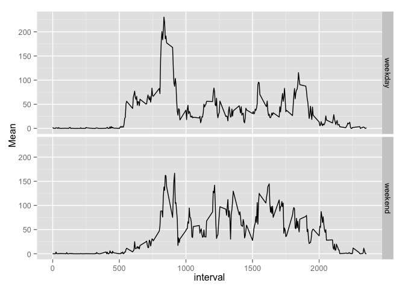

# Reproducible Research: Peer Assessment 1


## Loading and preprocessing the data

```r
data <- read.csv(file = "activity.csv",header = TRUE);
#remove uncomplete data
compData <- data[complete.cases(data),]

#convert date column
library(lubridate)
compData[,2] <- ymd(compData[,2])
data[,2] <- ymd(data[,2])
```


## What is mean total number of steps taken per day?

* Make a histogram of the total number of steps taken each day


```r
suppressPackageStartupMessages(library(dplyr))
group_step_by_day <- compData %>% 
                        group_by(date) %>% 
                        summarise( total = sum(steps) )
 

library(ggplot2)
g1 <- ggplot(
        group_step_by_day, 
        aes(date ,total  )
        )

g1 + geom_histogram( 
        aes(fill = total),
        binwidth = 0.1,stat="identity" 
        ) +
xlab("Date")  + 
ylab("Total Steps") 
```

 


* Calculate and report the mean and median total number of steps taken per day


```r
library(DT)
mean_median_step_by_day <- compData %>% 
                        group_by(date) %>% 
                        summarise( 
                                Mean = mean(steps), 
                                Median = median(steps) 
                                )


mean_median_step_by_day$date <- as.factor(mean_median_step_by_day$date)
datatable(mean_median_step_by_day,options = list( autoWidth = TRUE ,pageLength = 25 ))
```

<!--html_preserve--><div id="htmlwidget-4407" style="width:100%;height:auto;" class="datatables"></div>
<script type="application/json" data-for="htmlwidget-4407">{ "x": {
 "data": [
 [ "1", "2", "3", "4", "5", "6", "7", "8", "9", "10", "11", "12", "13", "14", "15", "16", "17", "18", "19", "20", "21", "22", "23", "24", "25", "26", "27", "28", "29", "30", "31", "32", "33", "34", "35", "36", "37", "38", "39", "40", "41", "42", "43", "44", "45", "46", "47", "48", "49", "50", "51", "52", "53" ],
[ "2012-10-02", "2012-10-03", "2012-10-04", "2012-10-05", "2012-10-06", "2012-10-07", "2012-10-09", "2012-10-10", "2012-10-11", "2012-10-12", "2012-10-13", "2012-10-14", "2012-10-15", "2012-10-16", "2012-10-17", "2012-10-18", "2012-10-19", "2012-10-20", "2012-10-21", "2012-10-22", "2012-10-23", "2012-10-24", "2012-10-25", "2012-10-26", "2012-10-27", "2012-10-28", "2012-10-29", "2012-10-30", "2012-10-31", "2012-11-02", "2012-11-03", "2012-11-05", "2012-11-06", "2012-11-07", "2012-11-08", "2012-11-11", "2012-11-12", "2012-11-13", "2012-11-15", "2012-11-16", "2012-11-17", "2012-11-18", "2012-11-19", "2012-11-20", "2012-11-21", "2012-11-22", "2012-11-23", "2012-11-24", "2012-11-25", "2012-11-26", "2012-11-27", "2012-11-28", "2012-11-29" ],
[            0.4375, 39.41666666666666, 42.06944444444444, 46.15972222222222, 53.54166666666666, 38.24652777777778, 44.48263888888889,            34.375, 35.77777777777778, 60.35416666666666, 43.14583333333334, 52.42361111111111, 35.20486111111111,            52.375, 46.70833333333334, 34.91666666666666, 41.07291666666666,          36.09375, 30.62847222222222, 46.73611111111111, 30.96527777777778, 29.01041666666667, 8.652777777777779, 23.53472222222222, 35.13541666666666, 39.78472222222222, 17.42361111111111,          34.09375, 53.52083333333334, 36.80555555555556, 36.70486111111111, 36.24652777777778,           28.9375, 44.73263888888889, 11.17708333333333, 43.77777777777778, 37.37847222222222, 25.47222222222222, 0.1423611111111111, 18.89236111111111, 49.78819444444444, 52.46527777777778, 30.69791666666667, 15.52777777777778, 44.39930555555556, 70.92708333333333, 73.59027777777777, 50.27083333333334, 41.09027777777778, 38.75694444444444, 47.38194444444444, 35.35763888888889,          24.46875 ],
[                 0,                 0,                 0,                 0,                 0,                 0,                 0,                 0,                 0,                 0,                 0,                 0,                 0,                 0,                 0,                 0,                 0,                 0,                 0,                 0,                 0,                 0,                 0,                 0,                 0,                 0,                 0,                 0,                 0,                 0,                 0,                 0,                 0,                 0,                 0,                 0,                 0,                 0,                 0,                 0,                 0,                 0,                 0,                 0,                 0,                 0,                 0,                 0,                 0,                 0,                 0,                 0,                 0 ] 
],
"isDF": true,
"container": "<table class=\"display\">\n  <thead>\n    <tr>\n      <th> </th>\n      <th>date</th>\n      <th>Mean</th>\n      <th>Median</th>\n    </tr>\n  </thead>\n</table>",
"options": {
 "autoWidth": true,
"pageLength":                25,
"columnDefs": [
 {
 "orderable": false,
"targets":                 0 
},
{
 "className": "dt-right",
"targets": [                 2,                 3 ] 
} 
],
"order": [] 
},
"callback": "function(table) {\nreturn table;\n}",
"colnames": [ " ", "date", "Mean", "Median" ] 
},"evals": [ "callback" ] }</script><!--/html_preserve-->


## What is the average daily activity pattern?

```r
average_dayly <- compData %>% 
                        group_by(date) %>% 
                        group_by(interval) %>% 
                        summarise( 
                                Mean = mean(steps)
                                )


max_interval <- average_dayly[average_dayly$Mean==max(average_dayly$Mean),]$interval;
 
g <- ggplot(
        average_dayly, 
        aes(interval,Mean)
        )

g + geom_line() + geom_vline(xintercept = max_interval  , colour="green", linetype = "longdash")+
         annotate("text", x = max_interval, y = -2, label = max_interval)
```

 

The 5-minute interval that contains the maximum number of steps on average across all the days in the dataset is **835**.


## Imputing missing values

Calculate and report the total number of missing values in the dataset (i.e. the total number of rows with NAs)


```r
number_NA <- sum(!complete.cases(data))
```
  
The total number of rows with NAs is **2304**.


Devise a strategy for filling in all of the missing values in the dataset. The strategy does not need to be sophisticated. For example, you could use the mean/median for that day, or the mean for that 5-minute interval, etc.

```r
nas <- data[!complete.cases(data), ]

for(i in 1:dim(nas)[1]){
        nas[i,]$steps <- average_dayly[average_dayly$interval==nas[i,]$interval,]$Mean        
}


#Create a new dataset that is equal to the original dataset but with the missing data filled in.
data_full <- data
data_full[!complete.cases(data_full), ] <- nas

 


full_group_step_by_day <- data_full %>% 
                        group_by(date) %>% 
                        summarise( total = sum(steps) )
 

#Make a histogram of the total number of steps taken each day and Calculate and report the mean and median total number of steps taken per day. 

h <- ggplot(
        full_group_step_by_day, 
        aes(date ,total  )
        )

h + geom_histogram( 
        aes(fill = total),
        binwidth = 0.1,stat="identity" 
        ) +
xlab("Date")  + 
ylab("Total Steps")  
```

 

```r
full_mean_median_step_by_day <- data_full %>% 
                        group_by(date) %>% 
                        summarise( 
                                Mean = mean(steps), 
                                Median = median(steps) 
                                )


full_mean_median_step_by_day$date <- as.factor(full_mean_median_step_by_day$date)
datatable(full_mean_median_step_by_day,options = list( autoWidth = TRUE ,pageLength = 25 ))
```

<!--html_preserve--><div id="htmlwidget-9456" style="width:100%;height:auto;" class="datatables"></div>
<script type="application/json" data-for="htmlwidget-9456">{ "x": {
 "data": [
 [ "1", "2", "3", "4", "5", "6", "7", "8", "9", "10", "11", "12", "13", "14", "15", "16", "17", "18", "19", "20", "21", "22", "23", "24", "25", "26", "27", "28", "29", "30", "31", "32", "33", "34", "35", "36", "37", "38", "39", "40", "41", "42", "43", "44", "45", "46", "47", "48", "49", "50", "51", "52", "53", "54", "55", "56", "57", "58", "59", "60", "61" ],
[ "2012-10-01", "2012-10-02", "2012-10-03", "2012-10-04", "2012-10-05", "2012-10-06", "2012-10-07", "2012-10-08", "2012-10-09", "2012-10-10", "2012-10-11", "2012-10-12", "2012-10-13", "2012-10-14", "2012-10-15", "2012-10-16", "2012-10-17", "2012-10-18", "2012-10-19", "2012-10-20", "2012-10-21", "2012-10-22", "2012-10-23", "2012-10-24", "2012-10-25", "2012-10-26", "2012-10-27", "2012-10-28", "2012-10-29", "2012-10-30", "2012-10-31", "2012-11-01", "2012-11-02", "2012-11-03", "2012-11-04", "2012-11-05", "2012-11-06", "2012-11-07", "2012-11-08", "2012-11-09", "2012-11-10", "2012-11-11", "2012-11-12", "2012-11-13", "2012-11-14", "2012-11-15", "2012-11-16", "2012-11-17", "2012-11-18", "2012-11-19", "2012-11-20", "2012-11-21", "2012-11-22", "2012-11-23", "2012-11-24", "2012-11-25", "2012-11-26", "2012-11-27", "2012-11-28", "2012-11-29", "2012-11-30" ],
[ 37.38259958071279,            0.4375, 39.41666666666666, 42.06944444444444, 46.15972222222222, 53.54166666666666, 38.24652777777778, 37.38259958071279, 44.48263888888889,            34.375, 35.77777777777778, 60.35416666666666, 43.14583333333334, 52.42361111111111, 35.20486111111111,            52.375, 46.70833333333334, 34.91666666666666, 41.07291666666666,          36.09375, 30.62847222222222, 46.73611111111111, 30.96527777777778, 29.01041666666667, 8.652777777777779, 23.53472222222222, 35.13541666666666, 39.78472222222222, 17.42361111111111,          34.09375, 53.52083333333334, 37.38259958071279, 36.80555555555556, 36.70486111111111, 37.38259958071279, 36.24652777777778,           28.9375, 44.73263888888889, 11.17708333333333, 37.38259958071279, 37.38259958071279, 43.77777777777778, 37.37847222222222, 25.47222222222222, 37.38259958071279, 0.1423611111111111, 18.89236111111111, 49.78819444444444, 52.46527777777778, 30.69791666666667, 15.52777777777778, 44.39930555555556, 70.92708333333333, 73.59027777777777, 50.27083333333334, 41.09027777777778, 38.75694444444444, 47.38194444444444, 35.35763888888889,          24.46875, 37.38259958071279 ],
[ 34.11320754716981,                 0,                 0,                 0,                 0,                 0,                 0, 34.11320754716981,                 0,                 0,                 0,                 0,                 0,                 0,                 0,                 0,                 0,                 0,                 0,                 0,                 0,                 0,                 0,                 0,                 0,                 0,                 0,                 0,                 0,                 0,                 0, 34.11320754716981,                 0,                 0, 34.11320754716981,                 0,                 0,                 0,                 0, 34.11320754716981, 34.11320754716981,                 0,                 0,                 0, 34.11320754716981,                 0,                 0,                 0,                 0,                 0,                 0,                 0,                 0,                 0,                 0,                 0,                 0,                 0,                 0,                 0, 34.11320754716981 ] 
],
"isDF": true,
"container": "<table class=\"display\">\n  <thead>\n    <tr>\n      <th> </th>\n      <th>date</th>\n      <th>Mean</th>\n      <th>Median</th>\n    </tr>\n  </thead>\n</table>",
"options": {
 "autoWidth": true,
"pageLength":                25,
"columnDefs": [
 {
 "orderable": false,
"targets":                 0 
},
{
 "className": "dt-right",
"targets": [                 2,                 3 ] 
} 
],
"order": [] 
},
"callback": "function(table) {\nreturn table;\n}",
"colnames": [ " ", "date", "Mean", "Median" ] 
},"evals": [ "callback" ] }</script><!--/html_preserve-->

###Do these values differ from the estimates from the first part of the assignment?   
Yes  


```r
p <- ggplot() + 
        geom_histogram( data = full_group_step_by_day,
        aes(date ,total ,color = "Full"),
        binwidth = 0.1,stat="identity" 
        ) +
        geom_histogram( data = group_step_by_day,
        aes(date ,total ,color = "without NAs"),
        binwidth = 0.1,stat="identity" 
        ) +
        
xlab("Date")  + 
ylab("Total Steps")

p
```

 


###What is the impact of imputing missing data on the estimates of the total daily number of steps?  
increase Median of total daily number of steps  


 
## Are there differences in activity patterns between weekdays and weekends?


```r
#Create a new factor variable in the dataset with two levels – “weekday” and “weekend” indicating whether a given date is a weekday or weekend day.
suppressPackageStartupMessages(library(chron))
data_full_week <- data_full %>% mutate( type = ifelse( is.weekend(date),yes = "weekend",no = "weekday" ) )


full_average_dayly_we <- data_full_week %>% 
                        filter(type=="weekend") %>% 
                        group_by(date) %>% 
                        group_by(interval) %>% 
                        summarise( 
                                Mean = mean(steps) 
                                )
full_average_dayly_we$type <-"weekend"

full_average_dayly_wd <- data_full_week %>% 
                        filter(type=="weekday") %>% 
                        group_by(date) %>% 
                        group_by(interval) %>% 
                        summarise( 
                                Mean = mean(steps) 
                                )
 
full_average_dayly_wd$type <- "weekday"

full_avg_dayly <- rbind(full_average_dayly_wd,full_average_dayly_we)


g <- ggplot(full_avg_dayly,aes(interval,Mean))

g + geom_line( )+facet_grid(type~.)
```

 

